# Create State Machine

Generate a state machine implementation with states, transitions, events, and proper lifecycle management following robotics behavior patterns and project conventions.

## When to Use This Prompt

- Implementing robot behavior control
- Creating finite state machines for system modes
- Need structured state transitions with guards and actions
- Building hierarchical state machines
- Implementing behavior trees or reactive control systems

## Prerequisites

- Understand required states and their behavior
- Know valid transitions between states
- Identified events that trigger transitions
- Package exists or will be created
- Familiarity with state machine patterns

## Inputs

### Required Inputs

- **Machine Name** `${input:machineName:robot_behavior}`: Name of the state machine (e.g., `robot_behavior`, `motion_control`)
- **States** `${input:states}`: Comma-separated list of states (e.g., `idle,walking,turning,stopped`)
- **Initial State** `${input:initialState}`: Starting state (must be in states list)

### Optional Inputs

- **Package Name**: Target package (detect from context or ask)
- **Language** `${input:language:python}`: Implementation language (`cpp` or `python`)
- **Transitions**: Specific allowed transitions (default: generate common ones)
- **Events**: Custom events that trigger transitions
- **Integration**: Integrate with ROS 2 lifecycle nodes (`yes`/`no`)

## Workflow

### Step 1: Validate Inputs

1. Parse states list and validate:
   - At least 2 states required
   - State names are valid identifiers (lowercase, underscores)
   - Initial state exists in states list
2. Suggest common state patterns if applicable:
   - Robot: `idle`, `active`, `error`, `shutdown`
   - Motion: `stopped`, `moving`, `turning`, `backing`
   - Task: `waiting`, `executing`, `paused`, `completed`, `failed`

### Step 2: Determine Package and Location

1. Check if package name is provided or detect from context
2. Verify package exists (create if needed using create-ros2-package)
3. Determine file location:
   - Python: `<package>/<package>/<machine_name>_sm.py`
   - C++: `<package>/src/<machine_name>_sm.cpp` and `<package>/include/<package>/<machine_name>_sm.hpp`

### Step 3: Design State Transitions

Generate a default transition table based on common patterns:

```
State Machine: <machine_name>
Initial State: <initial_state>

States:
- <state_1>: <description>
- <state_2>: <description>
...

Transitions:
<state_1> --[<event>]--> <state_2>
<state_2> --[<event>]--> <state_3>
...

Events:
- <event_1>: Trigger <state_1> -> <state_2>
- <event_2>: Trigger <state_2> -> <state_3>
...
```

### Step 4: Generate Python State Machine

Using `python-statemachine` library (already in drqp_brain dependencies):

```python
"""<MachineName> state machine implementation."""

from statemachine import State, StateMachine
from typing import Optional
import logging

logger = logging.getLogger(__name__)


class <MachineName>StateMachine(StateMachine):
    """State machine for <description>."""

    # Define states
    <state_1> = State('<State1>', initial=True)  # or False
    <state_2> = State('<State2>')
    <state_3> = State('<State3>')
    # ... more states

    # Define transitions
    <transition_name> = <source_state>.to(<target_state>)
    <transition_name_2> = <source_state_2>.to(<target_state_2>)
    # ... more transitions

    def __init__(self, *args, **kwargs):
        """Initialize state machine."""
        super().__init__(*args, **kwargs)
        logger.info(f"State machine initialized in state: {self.current_state.id}")

    # State entry/exit actions
    def on_enter_<state_name>(self):
        """Actions when entering <state_name> state."""
        logger.info(f"Entering state: <state_name>")
        # TODO: Add entry actions

    def on_exit_<state_name>(self):
        """Actions when exiting <state_name> state."""
        logger.info(f"Exiting state: <state_name>")
        # TODO: Add exit actions

    # Transition guards (conditions)
    def before_<transition_name>(self):
        """Guard condition for <transition_name> transition."""
        # TODO: Return True to allow transition, False to block
        return True

    # Transition actions
    def on_<transition_name>(self):
        """Actions during <transition_name> transition."""
        logger.info(f"Transition: <transition_name>")
        # TODO: Add transition actions

    # Business logic methods
    def process_event(self, event_name: str, **kwargs):
        """Process external event."""
        logger.debug(f"Processing event: {event_name}")
        
        # Map events to transitions
        event_map = {
            '<event_1>': self.<transition_1>,
            '<event_2>': self.<transition_2>,
            # ... more events
        }
        
        transition = event_map.get(event_name)
        if transition:
            try:
                transition(**kwargs)
                return True
            except Exception as e:
                logger.error(f"Transition failed: {e}")
                return False
        else:
            logger.warning(f"Unknown event: {event_name}")
            return False

    def get_current_state(self) -> str:
        """Get current state name."""
        return self.current_state.id
```

### Step 5: Generate C++ State Machine

Create header file (`<machine_name>_sm.hpp`):

```cpp
// Copyright notice

#pragma once

#include <functional>
#include <map>
#include <memory>
#include <string>
#include <vector>

namespace <package_name> {

// State enumeration
enum class <MachineName>State {
  <STATE_1>,
  <STATE_2>,
  <STATE_3>,
  // ... more states
};

// Event enumeration  
enum class <MachineName>Event {
  <EVENT_1>,
  <EVENT_2>,
  <EVENT_3>,
  // ... more events
};

// Convert enum to string
std::string to_string(<MachineName>State state);
std::string to_string(<MachineName>Event event);

// State machine class
class <MachineName>StateMachine {
public:
  using StateCallback = std::function<void()>;
  using TransitionCallback = std::function<void()>;
  using GuardCallback = std::function<bool()>;

  <MachineName>StateMachine();
  ~<MachineName>StateMachine() = default;

  // State queries
  <MachineName>State get_current_state() const;
  std::string get_current_state_name() const;

  // Event processing
  bool process_event(<MachineName>Event event);

  // Callback registration
  void register_state_entry_callback(<MachineName>State state, StateCallback callback);
  void register_state_exit_callback(<MachineName>State state, StateCallback callback);
  void register_transition_callback(<MachineName>State from, <MachineName>State to, 
                                    TransitionCallback callback);
  void register_guard(<MachineName>State from, <MachineName>State to, 
                     GuardCallback guard);

private:
  <MachineName>State current_state_;
  
  struct Transition {
    <MachineName>State from;
    <MachineName>State to;
    <MachineName>Event event;
    GuardCallback guard;
    TransitionCallback action;
  };
  
  std::vector<Transition> transitions_;
  std::map<<MachineName>State, std::vector<StateCallback>> entry_callbacks_;
  std::map<<MachineName>State, std::vector<StateCallback>> exit_callbacks_;

  void on_enter_state(<MachineName>State state);
  void on_exit_state(<MachineName>State state);
  bool execute_transition(const Transition& transition);
  void setup_transitions();
};

}  // namespace <package_name>
```

Create implementation file (`<machine_name>_sm.cpp`):

```cpp
// Copyright notice

#include "<package_name>/<machine_name>_sm.hpp"
#include <stdexcept>

namespace <package_name> {

std::string to_string(<MachineName>State state) {
  switch (state) {
    case <MachineName>State::<STATE_1>: return "<state_1>";
    case <MachineName>State::<STATE_2>: return "<state_2>";
    // ... more cases
    default: return "unknown";
  }
}

std::string to_string(<MachineName>Event event) {
  switch (event) {
    case <MachineName>Event::<EVENT_1>: return "<event_1>";
    case <MachineName>Event::<EVENT_2>: return "<event_2>";
    // ... more cases
    default: return "unknown";
  }
}

<MachineName>StateMachine::<MachineName>StateMachine()
: current_state_(<MachineName>State::<INITIAL_STATE>)
{
  setup_transitions();
}

void <MachineName>StateMachine::setup_transitions() {
  // Define allowed transitions
  // Example: <STATE_1> --[<EVENT_1>]--> <STATE_2>
  transitions_.push_back({
    <MachineName>State::<STATE_1>,
    <MachineName>State::<STATE_2>,
    <MachineName>Event::<EVENT_1>,
    nullptr,  // guard (optional)
    nullptr   // action (optional)
  });
  
  // TODO: Add more transitions
}

<MachineName>State <MachineName>StateMachine::get_current_state() const {
  return current_state_;
}

std::string <MachineName>StateMachine::get_current_state_name() const {
  return to_string(current_state_);
}

bool <MachineName>StateMachine::process_event(<MachineName>Event event) {
  // Find matching transition
  for (const auto& transition : transitions_) {
    if (transition.from == current_state_ && transition.event == event) {
      // Check guard condition
      if (transition.guard && !transition.guard()) {
        return false;
      }
      
      return execute_transition(transition);
    }
  }
  
  // No valid transition found
  return false;
}

bool <MachineName>StateMachine::execute_transition(const Transition& transition) {
  // Exit current state
  on_exit_state(current_state_);
  
  // Execute transition action
  if (transition.action) {
    transition.action();
  }
  
  // Enter new state
  current_state_ = transition.to;
  on_enter_state(current_state_);
  
  return true;
}

void <MachineName>StateMachine::on_enter_state(<MachineName>State state) {
  auto it = entry_callbacks_.find(state);
  if (it != entry_callbacks_.end()) {
    for (const auto& callback : it->second) {
      callback();
    }
  }
}

void <MachineName>StateMachine::on_exit_state(<MachineName>State state) {
  auto it = exit_callbacks_.find(state);
  if (it != exit_callbacks_.end()) {
    for (const auto& callback : it->second) {
      callback();
    }
  }
}

void <MachineName>StateMachine::register_state_entry_callback(
    <MachineName>State state, StateCallback callback) {
  entry_callbacks_[state].push_back(callback);
}

void <MachineName>StateMachine::register_state_exit_callback(
    <MachineName>State state, StateCallback callback) {
  exit_callbacks_[state].push_back(callback);
}

void <MachineName>StateMachine::register_transition_callback(
    <MachineName>State from, <MachineName>State to, TransitionCallback callback) {
  for (auto& transition : transitions_) {
    if (transition.from == from && transition.to == to) {
      transition.action = callback;
      break;
    }
  }
}

void <MachineName>StateMachine::register_guard(
    <MachineName>State from, <MachineName>State to, GuardCallback guard) {
  for (auto& transition : transitions_) {
    if (transition.from == from && transition.to == to) {
      transition.guard = guard;
      break;
    }
  }
}

}  // namespace <package_name>
```

### Step 6: Generate ROS 2 Integration (Optional)

If ROS 2 integration requested, create a node wrapper:

```python
"""ROS 2 node for <machine_name> state machine."""

import rclpy
from rclpy.node import Node
from std_msgs.msg import String
from <package_name>.<machine_name>_sm import <MachineName>StateMachine


class <MachineName>Node(Node):
    """ROS 2 node wrapping state machine."""

    def __init__(self):
        super().__init__('<machine_name>_node')
        
        # Create state machine
        self.sm = <MachineName>StateMachine()
        
        # Publishers
        self.state_pub = self.create_publisher(
            String,
            '/<machine_name>/state',
            10
        )
        
        # Subscribers
        self.event_sub = self.create_subscription(
            String,
            '/<machine_name>/event',
            self.event_callback,
            10
        )
        
        # Timer for state publishing
        self.timer = self.create_timer(0.1, self.publish_state)
        
        self.get_logger().info('State machine node initialized')

    def event_callback(self, msg):
        """Handle incoming events."""
        event_name = msg.data
        if self.sm.process_event(event_name):
            self.get_logger().info(f'Event processed: {event_name}')
        else:
            self.get_logger().warn(f'Event rejected: {event_name}')

    def publish_state(self):
        """Publish current state."""
        msg = String()
        msg.data = self.sm.get_current_state()
        self.state_pub.publish(msg)


def main(args=None):
    rclpy.init(args=args)
    node = <MachineName>Node()
    try:
        rclpy.spin(node)
    except KeyboardInterrupt:
        pass
    finally:
        node.destroy_node()
        rclpy.shutdown()


if __name__ == '__main__':
    main()
```

### Step 7: Generate Test File

Create test file with state machine test cases:

```python
"""Tests for <machine_name> state machine."""

import pytest
from <package_name>.<machine_name>_sm import <MachineName>StateMachine


class Test<MachineName>StateMachine:
    """Test suite for state machine."""

    @pytest.fixture
    def sm(self):
        """Create state machine instance."""
        return <MachineName>StateMachine()

    def test_initial_state(self, sm):
        """Test initial state is correct."""
        assert sm.get_current_state() == '<initial_state>'

    def test_valid_transition(self, sm):
        """Test valid state transition."""
        result = sm.process_event('<event_1>')
        assert result is True
        assert sm.get_current_state() == '<expected_state>'

    def test_invalid_transition(self, sm):
        """Test invalid transition is rejected."""
        result = sm.process_event('<invalid_event>')
        assert result is False
        assert sm.get_current_state() == '<initial_state>'

    def test_state_sequence(self, sm):
        """Test sequence of transitions."""
        sm.process_event('<event_1>')
        assert sm.get_current_state() == '<state_2>'
        
        sm.process_event('<event_2>')
        assert sm.get_current_state() == '<state_3>'

    def test_entry_exit_callbacks(self, sm):
        """Test state entry and exit callbacks are called."""
        entry_called = []
        exit_called = []
        
        def on_entry():
            entry_called.append(True)
            
        def on_exit():
            exit_called.append(True)
        
        # Register callbacks and test
        # ...
```

### Step 8: Generate State Diagram Documentation

Create a PlantUML or Mermaid diagram in README:

```markdown
## State Machine Diagram

```mermaid
stateDiagram-v2
    [*] --> <InitialState>
    <State1> --> <State2>: <event1>
    <State2> --> <State3>: <event2>
    <State3> --> [*]
```


```

### Step 9: Update Build Configuration

Update CMakeLists.txt or setup.py to include new files.

## Output Expectations

### Success Criteria

- State machine class created with all states
- Transitions properly defined
- Entry/exit actions for each state
- Event processing method implemented
- Test file with comprehensive test cases
- Documentation with state diagram
- ROS 2 integration (if requested)
- Build configuration updated

### Generated Output Summary

```
✅ Created state machine: <machine_name>
📦 Package: <package_name>
🔄 Language: <language>

📊 States (<count>):
   - <state_1> (initial)
   - <state_2>
   - ...

🔀 Transitions:
   <state_1> --[<event_1>]--> <state_2>
   <state_2> --[<event_2>]--> <state_3>
   ...

📝 Generated files:
   - State machine: <sm_file>
   - Tests: <test_file>
   - ROS 2 node: <node_file> (if applicable)
   - Documentation: README with state diagram

🧪 Test the state machine:
   colcon test --packages-select <package_name>

🚀 Run ROS 2 node (if integrated):
   ros2 run <package_name> <machine_name>_node
```

## Validation Steps

1. **Build package**: `colcon build --packages-select <package_name>`
2. **Run tests**: `colcon test --packages-select <package_name>`
3. **Check state transitions**: Verify all transitions work correctly
4. **Test guards**: Ensure guard conditions prevent invalid transitions
5. **Verify callbacks**: Check entry/exit actions are called
6. **Test ROS integration**: If applicable, test with ros2 topic pub

## Quality Assurance

- [ ] All states are defined
- [ ] Initial state is specified
- [ ] Transitions cover all state changes
- [ ] Guard conditions prevent invalid transitions
- [ ] Entry/exit actions are implemented
- [ ] Event processing handles unknown events gracefully
- [ ] Test coverage includes all transitions
- [ ] State diagram accurately represents machine
- [ ] ROS 2 integration (if requested) works correctly
- [ ] Documentation explains states and transitions

## Edge Cases

- **Circular transitions**: Allow state to transition to itself
- **Multiple transitions**: Same state can transition to multiple targets based on events
- **Invalid events**: Gracefully handle unknown events
- **Guard failures**: Log when guard blocks transition
- **Concurrent events**: Python statemachine handles this, C++ needs threading consideration
- **State persistence**: Consider saving/restoring state across restarts

## Related Resources

- [python-statemachine Documentation](https://python-statemachine.readthedocs.io/)
- [UML State Machine](https://en.wikipedia.org/wiki/UML_state_machine)
- [Behavior Trees (alternative pattern)](https://www.behaviortree.dev/)
- Example: `packages/runtime/drqp_brain/` uses state machines
- [create-ros2-package prompt](./create-ros2-package.prompt.md)
- [add-test-file prompt](./add-test-file.prompt.md)
