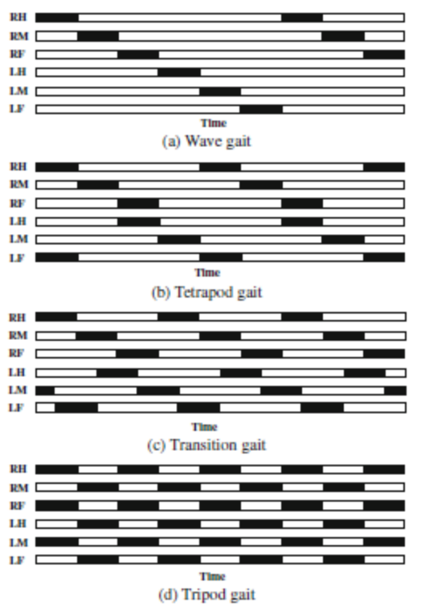

---
jupytext:
  text_representation:
    extension: .md
    format_name: myst
    format_version: 0.13
    jupytext_version: 1.17.2
kernelspec:
  display_name: .venv
  language: python
  name: python3
---

# 3. Generating gaits

The next step in developing the robot kinematics is to generate various gaits. First, lets familiarize ourselves with the concept of gaits. Gait is a coordinated sequence of movements of the robot legs and body to achieve smooth locomotion.

The gait cycle of a hexapod robot refers to the sequential movement of its six legs to achieve locomotion. It consists of two main phases for each leg:

 1. Stance Phase – The leg is in contact with the ground, providing support and propulsion as it moves backward relative to the body.
 2. Swing Phase – The leg lifts off the ground, moves forward, and prepares for the next stance phase.

To get an idea of the variance and complexity between gaits, Fig 1. shows four typical gaits. The six legs, right and left hind, middle and front, indicated as RH, RM, RF, LH, LM, and LF. Stance phase is shown in white, swing phase in black.



Fig 1. Four typical hexapodal gaits, depicting each of the six legs as either supporting (white) or recovering (black). Image source: (Chen et al. 2012) [borrowed from hexapodrobot.weebly.com](https://hexapodrobot.weebly.com/the-legs.html)

The three most common gaits for hexapods are the Wave, Transition (Ripple) and Tripod gaits. These are the three gaits we are going to implement in this notebook. Wave gait is the simplest and most stable as robot lifts only one leg at a time, it makes it the slowest one as well. Transition (ripple) gait is an improvement over the Wave gait as it allows to lift two legs at a time, with the half-phase shift. This makes it faster, at the slight cost of stability. Finally, the Tripod gait is the fastest and least stable one as it lifts three legs at a time.

+++ {"tags": ["remove-cell"]}

## Setting up the Jupyter notebook for experimentation

The next couple of cells are designated to the setup of the notebook environment.

The first step is to enable live python modules reloading, so changes in the python code of imported files are immediately reflected in the notebook without restarting the kernel.

```{code-cell} ipython3
:tags: [remove-cell]

# Enable python modules live reloading
%load_ext autoreload
%autoreload 2
```

+++ {"tags": ["remove-cell"]}

The next step is configuring matplotlib backend. Widget backend allows to interact with the plots in the notebook and is supported in Google Colab and VSCode. SVG format is used for the plots to make them look good in the hosted sphinx documentation.

```{code-cell} ipython3
:tags: [remove-cell]

%config InlineBackend.figure_formats = ['svg']
%matplotlib widget

import matplotlib.pyplot as plt

plt.ioff()  # this is equivalent to using inline backend, but figures have to be displayed manually
```

## Parametric gait generator

The easiest generic way to implement gait generation is to use a parametric function. The parametric function is defined in the leg's local coordinate system, with the origin at the leg's base and the X axis pointing forward. The function takes a single parameter, the phase of the gait cycle (0 to 1), and returns the leg's offset in the local coordinate system at that phase.

The parametric function is defined as a piecewise function that describes the leg's movement in the swing and stance phases. In the swing phase, the leg moves forward in the X direction and up in the Z direction. In the stance phase, the leg moves backward in the X direction and stays at the ground level (Z=0).

The swing and stance phases are defined by the `swing_duration` parameter, which is the fraction of the gait cycle that the leg is in the air. The swing phase starts at the beginning of the gait cycle and ends at `swing_duration`. The stance phase starts at `swing_duration` and ends at the end of the gait cycle.

The parametric function is defined as follows:

```{code-cell} ipython3
:tags: [remove-cell]

import jupyter_utils

jupyter_utils.display_file(
    '../../../packages/runtime/drqp_brain/drqp_brain/parametric_gait_generator.py',
    start_after='# Parametric function - START',
    end_before='# Parametric function - END',
)
```

```{literalinclude} ../../../packages/runtime/drqp_brain/drqp_brain/parametric_gait_generator.py
:start-after: '# Parametric function - START'
:end-before: '# Parametric function - END'
```

With this function in place, we can now implement the gait generators for the three gaits. The gait generators are defined in the `gaits` dictionary in the `ParametricGaitGenerator` class. The keys of the dictionary are the gait types, and the values are the parameters of the gait. The parameters include the swing duration and the swing phase start offsets for each leg. The swing phase start offsets define the phase at which the leg starts the swing phase.

```{code-cell} ipython3
:tags: [remove-cell]

jupyter_utils.display_file(
    '../../../packages/runtime/drqp_brain/drqp_brain/parametric_gait_generator.py',
    start_after='# Gait params - START',
    end_before='# Gait params - END',
)
```

```{literalinclude} ../../../packages/runtime/drqp_brain/drqp_brain/parametric_gait_generator.py
:start-after: '# Gait params - START'
:end-before: '# Gait params - END'
```

## Visualizing the gaits

The `GaitsVisualizer` class provides a convenient way to visualize the gaits. The `visualize_continuous` method visualizes each axis of the gait in 2D, while the `visualize_continuous_in_3d` method visualizes the gait in 3D.

```{code-cell} ipython3
from drqp_brain.models import HexapodModel
from drqp_brain.parametric_gait_generator import GaitType, ParametricGaitGenerator
from plotting import animate_hexapod_gait, GaitsVisualizer, is_sphinx_build

hexapod = HexapodModel()
hexapod.forward_kinematics(0, -25, 110)

gait_gen = ParametricGaitGenerator(step_length=120, step_height=50)

visualizer = GaitsVisualizer()
```

### Animating the gaits

In order to better understand how the gait works in 3D, we can animate the hexapod moving in the gait. The `animate_hexapod_gait` function below does exactly that. It takes the hexapod model, the gait generator, and the number of steps to animate. It then animates the hexapod moving in the gait for the specified number of steps.

```{literalinclude} plotting/hexapod.py
:start-after: '# Animate gait - START'
:end-before: '# Animate gait - END'
```

### Wave gait

Wave gait is the simplest gait where only one leg is in swing phase at a time. The swing phase progresses from one leg to the next in a wave-like manner.

```{code-cell} ipython3
gait_gen.current_gait = GaitType.wave
visualizer.visualize_continuous(gait_gen, _steps=100)
_ = visualizer.visualize_continuous_in_3d(gait_gen, _steps=100)

anim = animate_hexapod_gait(hexapod, gait_gen, interactive=True, skip=False)
```

### Ripple gait

Ripple gait is similar to wave gait, but two legs are in swing phase at a time. The swing phase progresses from one leg to the next with a half-phase offset.

```{code-cell} ipython3
gait_gen.current_gait = GaitType.ripple
visualizer.visualize_continuous(gait_gen, _steps=100)
_ = visualizer.visualize_continuous_in_3d(gait_gen, _steps=100)
anim = animate_hexapod_gait(hexapod, gait_gen, interactive=True, skip=False)
```

### Tripod gait

In tripod gait, the robot legs move in two groups of three:

- group A: left-front, right-middle, and left-back
- group B: right-front, left-middle, and right-back.

while one group is in stance phase, the other group is in swing phase and cycle repeats.

```{code-cell} ipython3
gait_gen.current_gait = GaitType.tripod
visualizer.visualize_continuous(gait_gen, _steps=100)
_ = visualizer.visualize_continuous_in_3d(gait_gen, _steps=100)
anim = animate_hexapod_gait(hexapod, gait_gen, interactive=True, skip=False)
```

## Directional Gait Decorator

In order to add direction to the generated gait, we can create a decorator class that will take the generated offsets and apply a rotation to them. This way we can control the direction of the movement.

### TL;DR

We need a 2D rotation matrix that aligns the offsets (originally along the X-axis) with an arbitrary direction vector $[dx, dy]$. The rotation matrix that achieves this is:

\begin{equation}
\begin{bmatrix}
dx & -dy\\
dy & dx
\end{bmatrix}
\end{equation}

### Why This Works

- Original offsets are along the X-axis, meaning they can be represented as $[x, 0]$.
- A standard 2D rotation matrix for an angle $\theta$ is:

\begin{equation}
R=\begin{bmatrix}
\cos\theta & -\sin\theta\\
\sin\theta & \cos\theta
\end{bmatrix}
\end{equation}

- The unit direction vector $[dx, dy]$ corresponds to the cosine and sine of some angle, where:

\begin{equation}
\begin{aligned}
dx = \cos\theta\\
dy = \sin\theta
\end{aligned}
\end{equation}

- Substituting these into the rotation matrix gives us the desired transformation matrix.

\begin{equation}
R=\begin{bmatrix}
dx & -dy\\
dy & dx
\end{bmatrix}
\end{equation}

```{code-cell} ipython3
from drqp_brain.geometry import AffineTransform, Point3D


class DirectionalGaitGenerator:
    """Gait generator decorator to allow steering in any direction."""

    def __init__(self, decorated):
        super().__init__()
        self.decorated = decorated

    def get_offsets_at_phase_for_leg(self, leg, phase, direction=Point3D([1, 0, 0])) -> Point3D:
        tf = self.__make_transform(direction)
        offsets = self.decorated.get_offsets_at_phase_for_leg(leg, phase)
        return tf.apply_point(offsets)

    @staticmethod
    def __make_transform(direction):
        # Normalize direction vector
        norm_direction = direction.normalized().numpy()

        # Create rotation matrix to align direction with x-axis
        # Ignore z-component as robot can't walk up. This also allows to generate steering in place
        direction_transform = AffineTransform.from_rotmatrix(
            [
                [norm_direction[0], -norm_direction[1], 0],
                [norm_direction[1], norm_direction[0], 0],
                [0, 0, 1],
            ]
        )
        return direction_transform


# Example usage
directional_tripod_gen = DirectionalGaitGenerator(gait_gen)

visualizer = GaitsVisualizer()
visualizer.visualize_continuous_in_3d(
    _gait_generator=directional_tripod_gen, direction=Point3D([1, 0, 0], 'Forward')
)
visualizer.visualize_continuous_in_3d(
    _gait_generator=directional_tripod_gen, direction=Point3D([0, 1, 0], 'Left')
)
visualizer.visualize_continuous_in_3d(
    _gait_generator=directional_tripod_gen, direction=Point3D([1, -1, 0], 'Forward-right')
)

# stomp in place
_ = visualizer.visualize_continuous_in_3d(
    _gait_generator=directional_tripod_gen, direction=Point3D([0, 0, 1], 'UP/Stomp')
)
```

Adding a direction vector did the trick, at least charts look good. Let's see it on the hexapod.

```{code-cell} ipython3
from plotting import animate_plot, is_sphinx_build, plot_hexapod, update_hexapod_plot


def animate_hexapod_gait_with_direction(
    hexapod: HexapodModel,
    gaits_gen,
    interactive=False,
    animate_trajectory=False,
    skip=False,
    total_steps=60,
    interval=16,
    view_elev=47.0,
    view_azim=-160,
    repeat=1,
    gait_lines=None,
    direction_degrees=0,
    animate_direction_degrees=False,
    direction_vector_length=100,
    trajectory_animation_start=0,
    trajectory_animation_end=1,
    feet_trails_frames=0,
):
    if skip:
        return

    if is_sphinx_build():
        repeat = 4

    leg_tips = [leg.tibia_end.copy() for leg in hexapod.legs]
    leg_centers = {leg.label: leg.tibia_end.copy() for leg in hexapod.legs}

    def set_pose(step, direction):
        step = step % total_steps  # handle repeats
        phase = step / total_steps  # interpolation phase
        for leg, leg_tip in zip(hexapod.legs, leg_tips):
            offsets = gaits_gen.get_offsets_at_phase_for_leg(leg.label, phase, direction=direction)
            leg.move_to(leg_tip + offsets)

    fig, ax, plot_data = plot_hexapod(hexapod, feet_trails_frames=feet_trails_frames)
    ax.view_init(elev=view_elev, azim=view_azim)
    dir_plot = ax.plot([0, direction_vector_length], [0, 0], [0, 0], 'y--')

    if animate_trajectory:
        trajectory_animation_end = 0

    visualizer = GaitsVisualizer()
    _, gait_lines = visualizer.visualize_continuous_in_3d(
        _gait_generator=gaits_gen,
        _steps=total_steps,
        _ax=ax,
        _phase_start=trajectory_animation_start,
        _phase_end=trajectory_animation_end,
        _plot_lines=None,
        _leg_centers=leg_centers,
    )

    def update(frame=0, direction_degrees=direction_degrees):
        if animate_direction_degrees:
            direction_degrees = (frame / (total_steps * repeat)) * 360
        direction = AffineTransform.from_rotvec(
            [0, 0, direction_degrees], degrees=True
        ).apply_point(Point3D([1, 0, 0]))
        set_pose(frame, direction)
        update_hexapod_plot(hexapod, plot_data)
        dir_line = direction * direction_vector_length
        dir_plot[0].set_data_3d([0, dir_line.x], [0, dir_line.y], [0, dir_line.z])

        nonlocal gait_lines
        nonlocal trajectory_animation_end
        if animate_trajectory:
            step = frame % total_steps  # handle repeats
            trajectory_animation_end = step / total_steps  # interpolation phase

        _, gait_lines = visualizer.visualize_continuous_in_3d(
            _gait_generator=gaits_gen,
            _steps=total_steps,
            _ax=ax,
            _phase_start=trajectory_animation_start,
            _phase_end=trajectory_animation_end,
            _plot_lines=gait_lines,
            _leg_centers=leg_centers,
            direction=direction,
        )
        if interactive:
            fig.canvas.draw_idle()

    animate_plot(
        fig,
        update,
        _interactive=interactive,
        _skip=skip,
        _frames=total_steps * repeat,
        _interval=interval,
        direction_degrees=(-180, 180, 1),
    )


hexapod = HexapodModel()
hexapod.forward_kinematics(0, -25, 110)

animate_hexapod_gait_with_direction(
    hexapod,
    directional_tripod_gen,
    animate_trajectory=True,
    animate_direction_degrees=True,
)
```

### Putting it all together

Now that we have all the pieces in place, we can put them together to create a full walk controller. The controller will take care of the following:

1. Process input command of the walk direction and rotation
2. Generate a walk trajectory based on the input direction
3. Generate a turn trajectory based on the input rotation
4. Combine the two trajectories into a single walk trajectory
5. Apply the walk trajectory to the robot based on the current robot legs position

```{code-cell} ipython3
:tags: [remove-cell]

import jupyter_utils

jupyter_utils.display_file(
    '../../../packages/runtime/drqp_brain/drqp_brain/walk_controller.py',
    start_after='# THE SOFTWARE.',
)
```

```{literalinclude} ../../../packages/runtime/drqp_brain/drqp_brain/walk_controller.py
:start-after: '# THE SOFTWARE.'
```

```{code-cell} ipython3
from drqp_brain.models import HexapodModel
from drqp_brain.walk_controller import WalkController
import numpy as np
from plotting import animate_plot, is_sphinx_build


def animate_hexapod_walk(
    walk_controller: WalkController,
    interactive=False,
    skip=False,
    fps=30,
    view_elev=47.0,
    view_azim=-160,
    repeat=1,
    feet_trails_frames=0,
):
    if skip:
        return

    if interactive:
        repeat = 100

    if is_sphinx_build():
        repeat = 8
        interactive = False

    fig, ax, plot_data = plot_hexapod(
        walk_controller.hexapod, feet_trails_frames=feet_trails_frames
    )
    ax.view_init(elev=view_elev, azim=view_azim)

    total_frames = fps * repeat

    last_frame = 0

    def animate(
        frame=0,
        direction_degrees=0,
        walk_speed=1,
        rotation_ratio=0,
    ):
        nonlocal last_frame
        if interactive and frame == last_frame:
            # other params are changing, don't update walker
            return

        phase = frame % fps
        phase = phase / fps

        if not interactive:
            walk_speed = np.interp(
                frame, [0, total_frames * 0.25, total_frames * 0.75, total_frames], [0, 1, 1, 0]
            )
            if frame < total_frames * 0.25 or frame > total_frames * 0.60:
                direction_degrees = 0
            else:
                direction_degrees = 30

            if frame < total_frames * 0.60:
                rotation_ratio = 0
            else:
                rotation_ratio = 1.0

        stride_direction = Point3D([1, 0, 0])
        stride_direction = AffineTransform.from_rotvec(
            [0, 0, direction_degrees], degrees=True
        ).apply_point(stride_direction)

        walk_controller.next(
            phase_override=phase,
            stride_direction=stride_direction,
            stride_ratio=walk_speed,
            rotation_ratio=rotation_ratio,
            verbose=False,
        )
        update_hexapod_plot(hexapod, plot_data)
        fig.canvas.draw_idle()
        last_frame = frame

    animate_plot(
        fig,
        animate,
        _interactive=interactive,
        _frames=total_frames,
        _interval=1000 / fps,
        walk_speed=(0, 2, 0.1),
        direction_degrees=(-180, 180, 1),
        rotation_ratio=(-2, 2, 0.1),
    )


hexapod = HexapodModel()
hexapod.forward_kinematics(0, -25, 110)
walker = WalkController(
    hexapod, step_length=120, step_height=60, rotation_speed_degrees=10, gait=GaitType.ripple
)

anim = animate_hexapod_walk(
    walker,
    interactive=True,
    skip=False,
    feet_trails_frames=40,
    repeat=5,
    view_elev=70,
    view_azim=180,
    fps=30,
)
```
