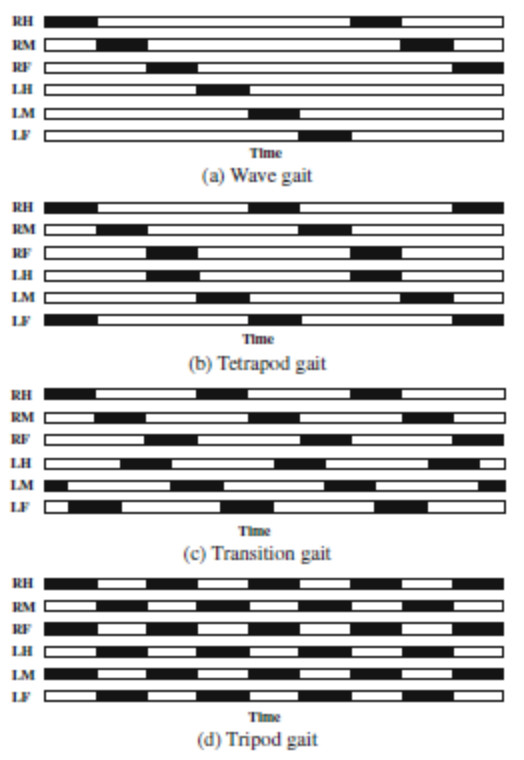

---
jupytext:
  text_representation:
    extension: .md
    format_name: myst
    format_version: 0.13
    jupytext_version: 1.17.2
kernelspec:
  display_name: .venv
  language: python
  name: python3
---

# 3. Generating gaits

The next step in developing the robot kinematics is to generate various gaits. First, lets familiarize ourselves with the concept of gaits. Gait is a coordinated sequence of movements of the robot legs and body to achieve smooth locomotion.

The gait cycle of a hexapod robot refers to the sequential movement of its six legs to achieve locomotion. It consists of two main phases for each leg:

1.  Stance Phase – The leg is in contact with the ground, providing support and propulsion as it moves backward relative to the body.
2.  Swing Phase – The leg lifts off the ground, moves forward, and prepares for the next stance phase.

To get an idea of the variance and complexity between gaits, Fig 1. shows four typical gaits. The six legs, right and left hind, middle and front, indicated as RH, RM, RF, LH, LM, and LF. Stance phase is shown in white, swing phase in black.



Fig 1. Four typical hexapodal gaits, depicting each of the six legs as either supporting (white) or recovering (black). Image source: (Chen et al. 2012) [borrowed from hexapodrobot.weebly.com](https://hexapodrobot.weebly.com/the-legs.html)

The three most common gaits for hexapods are the Wave, Transition (Ripple) and Tripod gaits. These are the three gaits we are going to implement in this notebook. Wave gait is the simplest and most stable as robot lifts only one leg at a time, it makes it the slowest one as well. Transition (ripple) gait is an improvement over the Wave gait as it allows to lift two legs at a time, with the half-phase shift. This makes it faster, at the slight cost of stability. Finally, the Tripod gait is the fastest and least stable one as it lifts three legs at a time.

+++ {"tags": ["remove-cell"]}

## Setting up the Jupyter notebook for experimentation

The next couple of cells are designated to the setup of the notebook environment.

The first step is to enable live python modules reloading, so changes in the python code of imported files are immediately reflected in the notebook without restarting the kernel.

```{code-cell} ipython3
:tags: [remove-cell]

# Enable python modules live reloading
%load_ext autoreload
%autoreload 2
```

+++ {"tags": ["remove-cell"]}

The next step is configuring matplotlib backend. Widget backend allows to interact with the plots in the notebook and is supported in Google Colab and VSCode. SVG format is used for the plots to make them look good in the hosted sphinx documentation.

```{code-cell} ipython3
:tags: [remove-cell]

%config InlineBackend.figure_formats = ['svg']
%matplotlib widget

import matplotlib.pyplot as plt

plt.ioff()  # this is equivalent to using inline backend, but figures have to be displayed manually
```

## Parametric gait generator

The easiest generic way to implement gait generation is to use a parametric function. The parametric function is defined in the leg's local coordinate system, with the origin at the leg's base and the X axis pointing forward. The function takes a single parameter, the phase of the gait cycle (0 to 1), and returns the leg's offset in the local coordinate system at that phase.

The parametric function is defined as a piecewise function that describes the leg's movement in the swing and stance phases. In the swing phase, the leg moves forward in the X direction and up in the Z direction. In the stance phase, the leg moves backward in the X direction and stays at the ground level (Z=0).

The swing and stance phases are defined by the `swing_duration` parameter, which is the fraction of the gait cycle that the leg is in the air. The swing phase starts at the beginning of the gait cycle and ends at `swing_duration`. The stance phase starts at `swing_duration` and ends at the end of the gait cycle.

The parametric function is defined as follows:

```{code-cell} ipython3
:tags: [remove-cell]

import jupyter_utils

jupyter_utils.display_file(
    '../../../packages/runtime/drqp_brain/drqp_brain/parametric_gait_generator.py',
    start_after='# Parametric function - START',
    end_before='# Parametric function - END',
)
```

```{literalinclude} ../../../packages/runtime/drqp_brain/drqp_brain/parametric_gait_generator.py
:start-after: '# Parametric function - START'
:end-before: '# Parametric function - END'
```

With this function in place, we can now implement the gait generators for the three gaits. The gait generators are defined in the `gaits` dictionary in the `ParametricGaitGenerator` class. The keys of the dictionary are the gait types, and the values are the parameters of the gait. The parameters include the swing duration and the swing phase start offsets for each leg. The swing phase start offsets define the phase at which the leg starts the swing phase.

```{code-cell} ipython3
:tags: [remove-cell]

jupyter_utils.display_file(
    '../../../packages/runtime/drqp_brain/drqp_brain/parametric_gait_generator.py',
    start_after='# Gait params - START',
    end_before='# Gait params - END',
)
```

```{literalinclude} ../../../packages/runtime/drqp_brain/drqp_brain/parametric_gait_generator.py
:start-after: '# Gait params - START'
:end-before: '# Gait params - END'
```

## Visualizing the gaits

The `GaitsVisualizer` class provides a convenient way to visualize the gaits. The `visualize_continuous` method visualizes each axis of the gait in 2D, while the `visualize_continuous_in_3d` method visualizes the gait in 3D.

```{code-cell} ipython3
from drqp_brain.parametric_gait_generator import GaitType, ParametricGaitGenerator
from drqp_kinematics.models import HexapodModel
from plotting import animate_hexapod_gait, GaitsVisualizer, is_sphinx_build

hexapod = HexapodModel()
hexapod.forward_kinematics(0, -25, 110)

gait_gen = ParametricGaitGenerator(step_length=120, step_height=50)

visualizer = GaitsVisualizer()
```

### Animating the gaits

In order to better understand how the gait works in 3D, we can animate the hexapod moving in the gait. The `animate_hexapod_gait` function below does exactly that. It takes the hexapod model, the gait generator, and the number of steps to animate. It then animates the hexapod moving in the gait for the specified number of steps.

```{literalinclude} plotting/hexapod.py
:start-after: '# Animate gait - START'
:end-before: '# Animate gait - END'
```

### Wave gait

Wave gait is the simplest gait where only one leg is in swing phase at a time. The swing phase progresses from one leg to the next in a wave-like manner.

```{code-cell} ipython3
gait_gen.current_gait = GaitType.wave
visualizer.visualize_continuous(gait_gen, _steps=100)
_ = visualizer.visualize_continuous_in_3d(gait_gen, _steps=100)

anim = animate_hexapod_gait(hexapod, gait_gen, interactive=True, skip=False)
```

### Ripple gait

Ripple gait is similar to wave gait, but two legs are in swing phase at a time. The swing phase progresses from one leg to the next with a half-phase offset.

```{code-cell} ipython3
gait_gen.current_gait = GaitType.ripple
visualizer.visualize_continuous(gait_gen, _steps=100)
_ = visualizer.visualize_continuous_in_3d(gait_gen, _steps=100)
anim = animate_hexapod_gait(hexapod, gait_gen, interactive=True, skip=False)
```

### Tripod gait

In tripod gait, the robot legs move in two groups of three:

- group A: left-front, right-middle, and left-back
- group B: right-front, left-middle, and right-back.

while one group is in stance phase, the other group is in swing phase and cycle repeats.

```{code-cell} ipython3
gait_gen.current_gait = GaitType.tripod
visualizer.visualize_continuous(gait_gen, _steps=100)
_ = visualizer.visualize_continuous_in_3d(gait_gen, _steps=100)
anim = animate_hexapod_gait(hexapod, gait_gen, interactive=True, skip=False)
```

## Directional Gait Decorator (learning reference)

The decorator in this section is intentionally kept as the smallest useful
model of directional walking. It rotates a unit, forward-only gait into the
direction selected by a learner. That makes it a good place to understand
phase offsets, coordinate frames, and why every leg needs the same command in
its own local frame.

It is a teaching and visualization path, not the runtime controller. The
runtime now uses the SE(2) twist controller in `WalkController`, which keeps
stance feet world-grounded while combining translation and yaw. Keep this
simple version when experimenting: it exposes the geometric idea without
requiring velocities, smoothing, or reachability saturation.

In order to add direction to the generated gait, we can create a decorator class that will take the generated offsets and apply a rotation to them. This way we can control the direction of the movement.

### TL;DR

We need a 2D rotation matrix that aligns the offsets (originally along the X-axis) with an arbitrary direction vector $[dx, dy]$. The rotation matrix that achieves this is:

\begin{equation}
\begin{bmatrix}
dx & -dy\\
dy & dx
\end{bmatrix}
\end{equation}

### Why This Works

- Original offsets are along the X-axis, meaning they can be represented as $[x, 0]$.
- A standard 2D rotation matrix for an angle $\theta$ is:

\begin{equation}
R=\begin{bmatrix}
\cos\theta & -\sin\theta\\
\sin\theta & \cos\theta
\end{bmatrix}
\end{equation}

- The unit direction vector $[dx, dy]$ corresponds to the cosine and sine of some angle, where:

\begin{equation}
\begin{aligned}
dx = \cos\theta\\
dy = \sin\theta
\end{aligned}
\end{equation}

- Substituting these into the rotation matrix gives us the desired transformation matrix.

\begin{equation}
R=\begin{bmatrix}
dx & -dy\\
dy & dx
\end{bmatrix}
\end{equation}

```{code-cell} ipython3
from drqp_kinematics.geometry import AffineTransform, Point3D


class DirectionalGaitGenerator:
    """Gait generator decorator to allow steering in any direction."""

    def __init__(self, decorated):
        super().__init__()
        self.decorated = decorated

    def get_offsets_at_phase_for_leg(self, leg, phase, direction=Point3D([1, 0, 0])) -> Point3D:
        tf = self.__make_transform(direction)
        offsets = self.decorated.get_offsets_at_phase_for_leg(leg, phase)
        return tf.apply_point(offsets)

    @staticmethod
    def __make_transform(direction):
        # Normalize direction vector
        norm_direction = direction.normalized().numpy()

        # Create rotation matrix to align direction with x-axis
        # Ignore z-component as robot can't walk up. This also allows to generate steering in place
        direction_transform = AffineTransform.from_rotmatrix(
            [
                [norm_direction[0], -norm_direction[1], 0],
                [norm_direction[1], norm_direction[0], 0],
                [0, 0, 1],
            ]
        )
        return direction_transform


# Example usage
directional_tripod_gen = DirectionalGaitGenerator(gait_gen)

visualizer = GaitsVisualizer()
visualizer.visualize_continuous_in_3d(
    _gait_generator=directional_tripod_gen, direction=Point3D([1, 0, 0], 'Forward')
)
visualizer.visualize_continuous_in_3d(
    _gait_generator=directional_tripod_gen, direction=Point3D([0, 1, 0], 'Left')
)
visualizer.visualize_continuous_in_3d(
    _gait_generator=directional_tripod_gen, direction=Point3D([1, -1, 0], 'Forward-right')
)

# stomp in place
_ = visualizer.visualize_continuous_in_3d(
    _gait_generator=directional_tripod_gen, direction=Point3D([0, 0, 1], 'UP/Stomp')
)
```

Adding a direction vector did the trick, at least charts look good. Let's see it on the hexapod.

```{code-cell} ipython3
from plotting import animate_plot, is_sphinx_build, plot_hexapod, update_hexapod_plot


def animate_hexapod_gait_with_direction(
    hexapod: HexapodModel,
    gaits_gen,
    interactive=False,
    animate_trajectory=False,
    skip=False,
    total_steps=60,
    interval=16,
    view_elev=47.0,
    view_azim=-160,
    repeat=1,
    gait_lines=None,
    direction_degrees=0,
    animate_direction_degrees=False,
    direction_vector_length=100,
    trajectory_animation_start=0,
    trajectory_animation_end=1,
    feet_trails_frames=0,
):
    if skip:
        return

    if is_sphinx_build():
        repeat = 4

    leg_tips = [leg.tibia_end.copy() for leg in hexapod.legs]
    leg_centers = {leg.label: leg.tibia_end.copy() for leg in hexapod.legs}

    def set_pose(step, direction):
        step = step % total_steps  # handle repeats
        phase = step / total_steps  # interpolation phase
        for leg, leg_tip in zip(hexapod.legs, leg_tips):
            offsets = gaits_gen.get_offsets_at_phase_for_leg(leg.label, phase, direction=direction)
            leg.move_to(leg_tip + offsets)

    fig, ax, plot_data = plot_hexapod(hexapod, feet_trails_frames=feet_trails_frames)
    ax.view_init(elev=view_elev, azim=view_azim)
    dir_plot = ax.plot([0, direction_vector_length], [0, 0], [0, 0], 'y--')

    if animate_trajectory:
        trajectory_animation_end = 0

    visualizer = GaitsVisualizer()
    _, gait_lines = visualizer.visualize_continuous_in_3d(
        _gait_generator=gaits_gen,
        _steps=total_steps,
        _ax=ax,
        _phase_start=trajectory_animation_start,
        _phase_end=trajectory_animation_end,
        _plot_lines=None,
        _leg_centers=leg_centers,
    )

    def update(frame=0, direction_degrees=direction_degrees):
        if animate_direction_degrees:
            direction_degrees = (frame / (total_steps * repeat)) * 360
        direction = AffineTransform.from_rotvec(
            [0, 0, direction_degrees], degrees=True
        ).apply_point(Point3D([1, 0, 0]))
        set_pose(frame, direction)
        update_hexapod_plot(hexapod, plot_data)
        dir_line = direction * direction_vector_length
        dir_plot[0].set_data_3d([0, dir_line.x], [0, dir_line.y], [0, dir_line.z])

        nonlocal gait_lines
        nonlocal trajectory_animation_end
        if animate_trajectory:
            step = frame % total_steps  # handle repeats
            trajectory_animation_end = step / total_steps  # interpolation phase

        _, gait_lines = visualizer.visualize_continuous_in_3d(
            _gait_generator=gaits_gen,
            _steps=total_steps,
            _ax=ax,
            _phase_start=trajectory_animation_start,
            _phase_end=trajectory_animation_end,
            _plot_lines=gait_lines,
            _leg_centers=leg_centers,
            direction=direction,
        )
        if interactive:
            fig.canvas.draw_idle()

    animate_plot(
        fig,
        update,
        _interactive=interactive,
        _skip=skip,
        _frames=total_steps * repeat,
        _interval=interval,
        direction_degrees=(-180, 180, 1),
    )


hexapod = HexapodModel()
hexapod.forward_kinematics(0, -25, 110)

animate_hexapod_gait_with_direction(
    hexapod,
    directional_tripod_gen,
    animate_trajectory=True,
    animate_direction_degrees=True,
)
```

## Gradual migration: directional gait to SE(2) twist locomotion

`DirectionalGaitGenerator` is a useful first model: rotate a one-dimensional
foot offset into the requested direction and add it to every neutral foot
position. The runtime controller has a subtly different question to answer,
however. A movement command describes how the _body_ should move while the
stance feet remain planted in the world. Once translation and yaw happen at
the same time, rotating and adding foot offsets independently is no longer the
motion of one rigid body.

The old runtime path generated a translation target and a rotation target,
then took a weighted average of the two. That has three undesirable
consequences:

- translation and rotation, despite having different units, compete for the
  same weights;
- adding yaw reduces translation and adding translation reduces yaw; and
- the resulting target is generally not the inverse of any rigid body pose,
  so a nominally planted foot drifts in the world.

`WalkController` now starts from one planar body twist and derives every foot
target from the corresponding SE(2) rigid motion. Translation and rotation are
therefore _unified_: neither trajectory is generated or blended separately.

### From a normalized command to a physical twist

Let the planar joystick command be
$\mathbf{u}=(u_x,u_y)^\mathsf{T}$ and let $\rho$ be the normalized turn
command. `command_to_twist()` first clips the joystick to the Euclidean unit
disk:

\begin{equation}
\bar{\mathbf{u}} =
\frac{\mathbf{u}}{\max(1,\lVert\mathbf{u}\rVert_2)}.
\end{equation}

Using an L2 norm is important. Every point on the unit circle produces the
same speed, so forward, lateral, and diagonal commands are isotropic. The
retired controller used an L1 magnitude, $|u_x|+|u_y|$, which made a diagonal
command behave differently from an axial one.

The duration for which one foot is in stance depends on the selected gait:

\begin{equation}
T*{\mathrm{stance}} =
T*{\mathrm{cycle}}(1-d\_{\mathrm{swing}}),
\end{equation}

where $d_{\mathrm{swing}}$ is the gait's swing fraction. The normalized inputs
then become a physical body-frame twist:

\begin{equation}
\begin{aligned}
\mathbf{v} & =
\bar{\mathbf{u}}\frac{L*{\mathrm{step}}}{T*{\mathrm{stance}}}, \\
\omega & =
\operatorname{clip}(\rho,-1,1)\,\omega\_{\max}, \\
\boldsymbol{\xi} & = (v_x,v_y,\omega).
\end{aligned}
\end{equation}

Here $\mathbf{v}$ is expressed in the model's distance units per second and
$\omega$ in radians per second. The runtime robot model uses metres; the
notebook model traditionally uses millimetres. The equations work in either
system as long as the geometry and `step_length` use the same distance unit.
The input's z component is intentionally ignored: planar twist commands do
not climb, and vertical motion remains the responsibility of swing height and
the separately requested body pose.

At full linear input, the body travels one configured step length over a
stance interval:

\begin{equation}
\Delta\mathbf{p}=\mathbf{v}T*{\mathrm{stance}}
=\bar{\mathbf{u}}L*{\mathrm{step}}.
\end{equation}

The angular counterpart of $\Delta\mathbf{p}$ is $\Delta\theta$. We define it
as the signed yaw produced by applying the constant angular velocity $\omega$
for one positive stance-duration interval:

\begin{equation}
\Delta\theta = \omega T_{\mathrm{stance}}.
\end{equation}

$\Delta\theta$ is a yaw _scale_ for one complete stride interval, not the
robot's current or accumulated heading. The gait coordinate introduced below
selects what signed fraction of this angle to use. An explicit
`omega_max_rad_sec` is the preferred configuration. If it is absent, the
legacy angle-per-stance setting is preserved by

\begin{equation}
\omega*{\max}=
\frac{\operatorname{radians}(\texttt{rotation_speed_degrees})}
{T*{\mathrm{stance}}}.
\end{equation}

Consequently, changing gait or cycle time retains the old configured yaw per
stance while changing the corresponding angular velocity. The ROS parameter
`rotation_speed_degrees` is deprecated, but remains as this compatibility
mapping.

`SteeringState` stores the resulting physical values as `linear_velocity` and
`angular_velocity`. Its older `direction` and `rotation_direction` properties
are now read-only transition aliases; they no longer mean normalized input.

### The gait offset is a time-like coordinate

Internally, `WalkController` configures `ParametricGaitGenerator` with unit
step length and unit step height. For each leg it receives two dimensionless
quantities:

- $s$, the x offset in $[-\tfrac12,+\tfrac12]$; and
- $h$, the normalized swing height in $[0,1]$.

During swing, the cycloid carries $s$ from $-\tfrac12$ to $+\tfrac12$ while
raising and lowering $h$. During stance, $s$ moves linearly back from
$+\tfrac12$ to $-\tfrac12$ and $h=0$. The controller does not interpret $s$
as a distance. Instead it uses $sT_{\mathrm{stance}}$ as the signed time at
which to evaluate the commanded rigid motion. This is why the same unit gait
profile can drive any step length, gait duty factor, and turn rate.

The relative yaw at coordinate $s$ is therefore

\begin{equation}
\theta(s) = s\Delta\theta
=s\omega T_{\mathrm{stance}}.
\end{equation}

The symbol $\theta(s)$ means the body's heading relative to the middle of the
stride, where $s=0$ and $\theta(0)=0$. It is not an absolute world heading.
The two stride endpoints are
$\theta(-\tfrac12)=-\Delta\theta/2$ and
$\theta(+\tfrac12)=+\Delta\theta/2$, so they are separated by the full angle
$\Delta\theta$.

### Integrating translation and yaw as one SE(2) motion

A body-frame planar twist has the matrix representation

\begin{equation}
\hat{\boldsymbol{\xi}}=
\begin{bmatrix}
0 & -\omega & v_x\\
\omega & 0 & v_y\\
0 & 0 & 0
\end{bmatrix}.
\end{equation}

Let $\mathbf{R}(\phi)$ denote the standard planar rotation matrix

\begin{equation}
\mathbf{R}(\phi)=
\begin{bmatrix}
\cos\phi & -\sin\phi\\
\sin\phi & \cos\phi
\end{bmatrix}.
\end{equation}

It rotates a planar vector from the body frame by the signed yaw $\phi$ into
the stride-relative reference frame. Rotation matrices are orthogonal, so

\begin{equation}
\mathbf{R}(\phi)^{-1}
=\mathbf{R}(\phi)^\mathsf{T}
=\mathbf{R}(-\phi).
\end{equation}

This identity is used later to express a world-grounded foot in the moving
body frame.

At stride coordinate $s$, the body pose relative to its pose at $s=0$ is the
SE(2) exponential

\begin{equation}
\mathbf{T}(s)=
\exp\!\left(sT\_{\mathrm{stance}}\hat{\boldsymbol{\xi}}\right)
=
\begin{bmatrix}
\mathbf{R}(\theta(s)) & \mathbf{p}(s)\\
\mathbf{0}^\mathsf{T} & 1
\end{bmatrix}.
\end{equation}

The block form above is shorthand for an ordinary $3\times3$ matrix.
$\mathbf{p}(s)$ is the two-coordinate translation column

\begin{equation}
\mathbf{p}(s)=
\begin{bmatrix}
p_x(s)\\
p_y(s)
\end{bmatrix},
\end{equation}

and $\mathbf{0}$ is a two-entry column of zeros. The superscript
$\mathsf{T}$ means _transpose_, which turns a column into a row:

\begin{equation}
\mathbf{0}=
\begin{bmatrix}
0\\
0
\end{bmatrix},
\qquad
\mathbf{0}^\mathsf{T}=
\begin{bmatrix}
0 & 0
\end{bmatrix}.
\end{equation}

Writing out all the blocks makes their roles more visible:

\begin{equation}
\mathbf{T}(s)=
\begin{bmatrix}
\cos\theta(s) & -\sin\theta(s) & p_x(s)\\
\sin\theta(s) & \cos\theta(s) & p_y(s)\\
0 & 0 & 1
\end{bmatrix}.
\end{equation}

The final row is a bookkeeping trick called _homogeneous coordinates_. A 2D
point $(x,y)$ is temporarily written as the three-entry column
$[x,y,1]^\mathsf{T}$. Multiplying it by $\mathbf{T}(s)$ rotates the first two
coordinates, adds $p_x(s)$ and $p_y(s)$, and leaves the final $1$ unchanged.
That extra coordinate lets one matrix represent both rotation and translation.

The translation itself is computed from the twist by

\begin{equation}
\begin{aligned}
\mathbf{p}(s) & =
\mathbf{V}(\theta(s))\,s\Delta\mathbf{p},\\
\mathbf{V}(\theta) & =
\begin{bmatrix}
\dfrac{\sin\theta}{\theta} &
-\dfrac{1-\cos\theta}{\theta}\\[6pt]
\dfrac{1-\cos\theta}{\theta} &
\dfrac{\sin\theta}{\theta}
\end{bmatrix}.
\end{aligned}
\end{equation}

In the definition of $\mathbf{V}(\theta)$, bare $\theta$ is the matrix's angle
argument. The controller evaluates it at the stride-relative angle
$\theta(s)$ defined above.

This is a stride-relative pose used to construct leg targets, not an
accumulated global pose or an odometry estimate. The current controller does
not integrate the twist across cycles.

The $\mathbf{V}$ matrix is the crucial coupling term. $\mathbf{v}$ is fixed in
the _rotating body frame_; as yaw changes, the same body-frame velocity points
in a continuously changing world direction. Its integral is a circular arc,
not the straight displacement $s\Delta\mathbf{p}$. Using the straight
displacement would be exact only when $\omega=0$ and only a first-order
approximation otherwise.

For $\omega\ne0$, the instantaneous centre of rotation in body coordinates is

\begin{equation}
\mathbf{c}=
\begin{bmatrix}
-v_y/\omega\\
v_x/\omega
\end{bmatrix}.
\end{equation}

This gives a geometric reading of a combined command: each foot traces the
arc imposed by the same centre of rotation, but its radius depends on that
foot's neutral position. A weighted translation/rotation blend cannot recover
these leg-specific arcs.

The ratios in $\mathbf{V}$ are indeterminate if evaluated directly at
$\theta=0$. `_se2_translation()` uses their Taylor expansions for
$|\theta|<10^{-5}$:

\begin{equation}
\begin{aligned}
\frac{\sin\theta}{\theta}
&=1-\frac{\theta^2}{6}+\frac{\theta^4}{120}+\mathcal{O}(\theta^6),\\
\frac{1-\cos\theta}{\theta}
&=\frac{\theta}{2}-\frac{\theta^3}{24}
+\frac{\theta^5}{720}+\mathcal{O}(\theta^7).
\end{aligned}
\end{equation}

Besides avoiding division by zero, this prevents cancellation in
$1-\cos\theta$ for nearly straight motion and makes the transition through
zero yaw continuous.

### World-grounded feet require the inverse body pose

Let $\mathbf{r}_i$ be leg $i$'s neutral foot position, captured when the
controller is constructed. Let $\mathbf{q}_i(s)$ be the target expressed in
the current body frame. A planted foot must reconstruct to the same world
point after applying the body pose:

\begin{equation}
\mathbf{R}(\theta(s))\mathbf{q}\_i(s)+\mathbf{p}(s)
=\mathbf{r}\_i.
\end{equation}

Solving for the target gives the central equation implemented by
`_foot_target_for_stride_offset()`:

\begin{equation}
\boxed{
\mathbf{q}\_i(s)=
\mathbf{R}(-\theta(s))
\left(\mathbf{r}\_i-\mathbf{p}(s)\right)
}.
\end{equation}

This inverse is also the reason for an apparent sign change from the simple
directional decorator. The decorator commands where the _foot_ should move;
the twist commands where the _body_ should move. If the body moves forward
over a planted foot, the foot necessarily moves backward when observed in the
body frame.

The important limiting cases fall out of the same equation:

\begin{equation}
\begin{array}{lll}
\omega=0
&\Longrightarrow&
\mathbf{q}\_i(s)=\mathbf{r}\_i-s\Delta\mathbf{p},\\[4pt]
\mathbf{v}=\mathbf{0}
&\Longrightarrow&
\mathbf{q}\_i(s)=\mathbf{R}(-s\Delta\theta)\mathbf{r}\_i,\\[4pt]
\mathbf{v}=\mathbf{0},\ \omega=0
&\Longrightarrow&
\mathbf{q}\_i(s)=\mathbf{r}\_i.
\end{array}
\end{equation}

The horizontal target follows this inverse rigid motion in both swing and
stance. Swing only adds the independent vertical term
$hL_{\mathrm{height}}$. When there is no motion, `targets_at()` returns exact
copies of the neutral feet rather than evaluating a tiny residual path.

### Time-based steering and phase

Raw command changes are filtered before they can reshape the stride. For a
control interval $\Delta t$ and steering time constant $\tau$,

\begin{equation}
\alpha=1-e^{-\Delta t/\tau},\qquad
\boldsymbol{\xi}_{\mathrm{proposed}}=
(1-\alpha)\boldsymbol{\xi}_{\mathrm{current}}
+\alpha\boldsymbol{\xi}\_{\mathrm{target}}.
\end{equation}

This is the exact discrete update of a first-order low-pass filter for a
constant target. It depends on elapsed time rather than frame count: splitting
one interval into smaller controller ticks produces the same result, apart
from any reachability saturation applied at the intermediate ticks.

`advance()` performs the stateful pipeline in this order:

1. convert normalized input to a target twist;
2. exponentially smooth all twist components;
3. saturate the complete proposed twist for reachability;
4. snap tiny linear or angular residuals to exact zero; and
5. advance phase by $\Delta t/T_{\mathrm{cycle}}$ only while motion remains.

Freezing phase at rest prevents an exponentially decaying command from making
the feet drift forever. `targets_at(phase, steering)`, by contrast, is a pure
query: repeated calls with the same arguments return the same targets and do
not advance phase or mutate the robot model.

### Reachability saturation preserves the commanded curve

A planar direction-only limit cannot certify a combined twist. Reachability
depends on the leg, swing height, yaw, body geometry, joint limits, and on
interior points of the curved path. In particular, robot workspaces can have
an inner unreachable region or joint-limit cuts even when both stride
endpoints are valid.

Before committing a proposed twist, `_twist_is_reachable()` samples 49 phases
over the half-open gait cycle for every leg. It constructs the complete 3D
target—including swing height—and calls analytic `solve_ik(clamp=False)`. A
sample is safe only if it is geometrically reachable _and_ within joint
limits. Checking the full gait also covers the different phase offsets of
wave, ripple, and tripod gaits.

If the proposal is unsafe, `_saturate_twist()` searches for one scalar
$k\in[0,1]$ such that

\begin{equation}
\boldsymbol{\xi}_{\mathrm{safe}}=k\boldsymbol{\xi}_{\mathrm{proposed}}
=(kv_x,kv_y,k\omega)
\end{equation}

is reachable. The implementation first verifies that the stationary pose is
valid, then performs 20 bisection steps along this one-dimensional ray in
twist space, assuming reachability is monotonic from rest along that ray. It
returns the largest sampled safe scale; if even the stationary pose is
invalid, it returns zero motion.

Scaling all three components together matters. It preserves
$v_y/v_x$, $\omega/\lVert\mathbf{v}\rVert_2$, and the instantaneous centre of
rotation $\mathbf{c}$. In other words, saturation slows and shortens the
commanded rigid motion without changing straight travel into a turn or
changing the radius of a commanded arc. Independently clipping translation
and yaw would change the path the operator requested.

This runtime check supersedes the retired `stride_limits.yaml` polar table and
its translation-only clamping. It evaluates the actual combined path against
the current analytic leg model, so safety no longer relies on a later IK
failure to reject an overlong stride.

### Target generation and body posing stay separate

The locomotion target is deliberately world-grounded. `targets_at()` accepts
the historical `body_direction` and `body_rotation` arguments for transition
compatibility but does not fold them into the gait path. The caller constructs
the independently requested body pose with `body_transform()` and applies it
before solving IK. Keeping target evaluation pure makes future trajectory
samples deterministic and avoids applying body translation or rotation twice.

### Putting it all together

The runtime loop calls `advance()` once with the measured elapsed time, then
uses the committed phase and saturated `SteeringState` to query targets. The
notebook animation below focuses on the geometry: it maps normalized controls
with `command_to_twist()` and evaluates `targets_at()` directly. It therefore
shows the same units, SE(2) exponential, inverse foot transform, and vertical
gait profile as runtime, while intentionally bypassing the stateful smoothing,
phase advancement, and reachability saturation performed by `advance()`.

```{code-cell} ipython3
:tags: [remove-cell]

import jupyter_utils

jupyter_utils.display_file(
    '../../../packages/runtime/drqp_brain/drqp_brain/walk_controller.py',
    start_after='# THE SOFTWARE.',
)
```

```{literalinclude} ../../../packages/runtime/drqp_brain/drqp_brain/walk_controller.py
:start-after: '# THE SOFTWARE.'
```

```{code-cell} ipython3
from drqp_brain.walk_controller import WalkController
from drqp_kinematics.models import HexapodModel
import numpy as np
from plotting import animate_plot, is_sphinx_build


def animate_hexapod_walk(
    walk_controller: WalkController,
    interactive=False,
    skip=False,
    fps=30,
    view_elev=47.0,
    view_azim=-160,
    repeat=1,
    feet_trails_frames=0,
):
    if skip:
        return

    if interactive:
        repeat = 100

    if is_sphinx_build():
        repeat = 8
        interactive = False

    fig, ax, plot_data = plot_hexapod(
        walk_controller.hexapod, feet_trails_frames=feet_trails_frames
    )
    ax.view_init(elev=view_elev, azim=view_azim)

    total_frames = fps * repeat

    last_frame = 0

    def animate(
        frame=0,
        direction_degrees=0,
        walk_speed=1,
        rotation_direction=0,
    ):
        nonlocal last_frame
        if interactive and frame == last_frame:
            # other params are changing, don't update walker
            return

        phase = frame % fps
        phase = phase / fps

        if not interactive:
            walk_speed = np.interp(
                frame, [0, total_frames * 0.25, total_frames * 0.75, total_frames], [0, 1, 1, 0]
            )
            if frame < total_frames * 0.25 or frame > total_frames * 0.60:
                direction_degrees = 0
            else:
                direction_degrees = 30

            if frame < total_frames * 0.60:
                rotation_direction = 0
            else:
                rotation_direction = 1.0

        stride_direction = Point3D([1, 0, 0])
        stride_direction = AffineTransform.from_rotvec(
            [0, 0, direction_degrees], degrees=True
        ).apply_point(stride_direction)

        steering = walk_controller.command_to_twist(
            stride_direction * walk_speed,
            rotation_direction,
        )
        targets = walk_controller.targets_at(phase, steering, verbose=False)
        walk_controller.apply_feet_targets(targets)
        update_hexapod_plot(hexapod, plot_data)
        fig.canvas.draw_idle()
        last_frame = frame

    animate_plot(
        fig,
        animate,
        _interactive=interactive,
        _frames=total_frames,
        _interval=1000 / fps,
        walk_speed=(0, 2, 0.1),
        direction_degrees=(-180, 180, 1),
        rotation_direction=(-2, 2, 0.1),
    )


hexapod = HexapodModel()
hexapod.forward_kinematics(0, -25, 110)
walker = WalkController(
    hexapod, step_length=120, step_height=60, rotation_speed_degrees=10, gait=GaitType.ripple
)

anim = animate_hexapod_walk(
    walker,
    interactive=True,
    skip=False,
    feet_trails_frames=40,
    repeat=5,
    view_elev=70,
    view_azim=180,
    fps=30,
)
```
