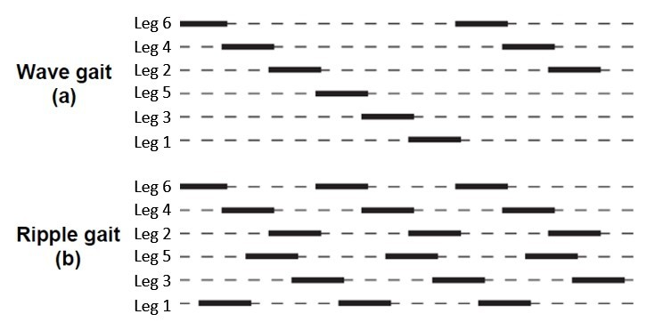

---
jupytext:
  text_representation:
    extension: .md
    format_name: myst
    format_version: 0.13
    jupytext_version: 1.17.2
kernelspec:
  display_name: .venv
  language: python
  name: python3
---

+++ {"tags": ["remove-cell"]}

## Setting up the Jupyter notebook for experimentation

The next couple of cells are designated to the setup of the notebook environment.

The first step is to enable live python modules reloading, so changes in the python code of imported files are immediately reflected in the notebook without restarting the kernel.

```{code-cell} ipython3
:tags: [remove-cell]

# Enable python modules live reloading
%load_ext autoreload
%autoreload 2
```

The next step is configuring matplotlib backend. Widget backend allows to interact with the plots in the notebook and is supported in Google Colab and VSCode. SVG format is used for the plots to make them look good in the hosted sphinx documentation.

```{code-cell} ipython3
:tags: [remove-cell]

%config InlineBackend.figure_formats = ['svg']
%matplotlib widget

import matplotlib.pyplot as plt
from plotting import display_and_close

plt.ioff()  # this is equivalent to using inline backend, but figures have to be displayed manually
```

Our new approach should satisfy the following requirements:

 1. Allow defining a gait trajectory.
 2. Allow defining a gait sequence.
 3. Allow defining a gait generator function that will combine the two above given a set of parameters.
 4. Allow steering, turing and transitioning between gaits and positions.

Gait trajectory are fairly straightforward and we have seen some solution using trigonometrical functions and polynomials already. Gait sequencing has been formulated mathematically before, however it can be expressed as phase offsets per leg. Each phase starts with lift and ends with push. By offsetting the leg phase we can define the sequence.

In order to achieve transitioning we need to implement trajectory interpolation. The simplest approach would be to use linear interpolation, however it may create jerkiness cause by sudden trajectory changes causing high deceleration and acceleration. Much better results can be achieved using [smoothing spline functions](https://docs.scipy.org/doc/scipy/tutorial/interpolate/smoothing_splines.html), e.g. a 2nd degree [B-spline](https://en.wikipedia.org/wiki/B-spline). B-spline allows a smooth transition between control points while remaining stable if some of the control points are changed, e.g. when new goal point is added. 2nd degree B-spline has continuous first derivative, which means that the velocity is smooth and has no sudden changes in direction.

```{code-cell} ipython3
from smoothing_splines import plot_spline, SplineType

frames_between_points = 30
# x, y, t
trajectory_points = np.array(
    [
        [0, 0, 0],
        [2, 1, frames_between_points * 0.5],
        [3, 1, frames_between_points * 0.75],
        [5, 2, frames_between_points * 2],
        [6, 0, frames_between_points * 5],
        [1, 4, frames_between_points * 6],
        [2, 5, frames_between_points * 7],
        [5, 3, frames_between_points * 7.5],
        [3, 3, frames_between_points * 8],
    ]
)
fig, ax = plt.subplots(2, 1)
fig.set_figheight(10)
ax[0].scatter(trajectory_points[::, 0], trajectory_points[::, 1], c='k', label='Trajectory points')

current_t = trajectory_points[3, 2] + 20
plot_spline(ax[0], current_t, trajectory_points, k=1)
spline_x, spline_y = plot_spline(
    ax[0],
    current_t,
    trajectory_points,
    k=3,
    derivatives=4,
    derivatives_ax=ax[1],
    bc_type='natural',
    spline_type=SplineType.interp,
    color='green',
)

for x, y, t in trajectory_points:
    ax[0].text(x, y + 0.2, f'{t=}')

ax[0].text(spline_x(current_t), spline_y(current_t) + 0.2, f'{current_t=}', color='green')

ax[0].legend()
ax[1].legend()

display_and_close(fig)
```

As you can see above, interpolating BSpline generates a smooth trajectory that follows the control points with smooth velocity changes, which will reduce strains on servos. However it comes at a cost of random overshooting that might be non desirable.
One of the approaches is to reduce smoothness by mixing in a linear trajectory. Animation below shows how it affects the trajectory.

```{code-cell} ipython3
# Animation size has reached 21028704 bytes, exceeding the limit of 20971520.0. If you're sure you want a larger animation embedded, set the animation.embed_limit rc parameter to a larger value (in MB). This and further frames will be dropped.
plt.rcParams['animation.embed_limit'] = 50


plt.ioff()
fig, ax = plt.subplots(1, 1)
fig.set_figheight(8)

num_items = 4
max_points = 7


def update(frame=0):
    ax.clear()
    ax.set_xlabel('x')
    ax.set_ylabel('y')
    ax.set_title('Trajectory smoothing using interpolating B-spline (time points are not uniform)')
    ax.set(xlim=(-1, 10), ylim=(-1, 10), aspect='equal')
    ax.grid(which='both', color='grey', linewidth=1, linestyle='-', alpha=0.2)

    first_point = frame // frames_between_points
    last_point = min(first_point + num_items, len(trajectory_points))
    control_points = trajectory_points[0 : last_point + 1]
    if len(control_points) > max_points:
        control_points = control_points[-max_points:]
    ##############################
    ax.scatter(trajectory_points[::, 0], trajectory_points[::, 1], c='k', label='All points')
    ax.scatter(control_points[::, 0], control_points[::, 1], c='r', label='Active points')

    for x, y, t in trajectory_points:
        ax.text(x, y + 0.2, f't={t}')

    ##############################
    # Uncomment to see other splines
    # spline_x, spline_y = plot_spline(ax, frame, control_points, 1, color='blue')
    # ax.text(spline_x(frame), spline_y(frame) + .2, f'curr_t={frame}', color='blue')

    # spline_x, spline_y = plot_spline(ax, frame, control_points, 2, color='orange')
    # ax.text(spline_x(frame), spline_y(frame) + .2, f'curr_t={frame}', color='orange')

    spline_x, spline_y = plot_spline(
        ax, frame, control_points, 3, color='green', bc_type='natural', mix=0.5
    )
    ax.text(spline_x(frame), spline_y(frame) + 0.2, f'curr_t={frame}', color='green')

    ax.legend()
    fig.canvas.draw_idle()


frames = len(trajectory_points) - 1

_ = animate_plot(fig, update, frames * frames_between_points, _interval=16, _interactive=False)
```

Let's put it all together and generate some gaits!



```{code-cell} ipython3
import matplotlib.pyplot as plt
from parametric_gait_generator import GaitType, ParametricGaitGenerator

gait_gen = ParametricGaitGenerator()
visualizer = GaitsVisualizer()

gait_gen.current_gait = GaitType.wave
axs = visualizer.visualize_continuous(gait_gen, _steps=500, _subtitle=' Wave gait')
_ = visualizer.visualize_continuous_in_3d(gait_gen, _steps=100, _step_length=gait_gen.step_length)

gait_gen.current_gait = GaitType.ripple
axs = visualizer.visualize_continuous(gait_gen, _steps=500, _subtitle=' Ripple gait', _num_phases=3)
_ = visualizer.visualize_continuous_in_3d(gait_gen, _steps=100, _step_length=gait_gen.step_length)


gait_gen.current_gait = GaitType.tripod
axs = visualizer.visualize_continuous(gait_gen, _steps=500, _subtitle=' Tripod gait')
_ = visualizer.visualize_continuous_in_3d(gait_gen, _steps=100, _step_length=gait_gen.step_length)
```

```{code-cell} ipython3
hexapod = HexapodModel()
hexapod.forward_kinematics(0, -25, 110)

gait_gen.step_length = 80
gait_gen.step_height = 40
gait_gen.current_gait = GaitType.ripple
dir_gait_gen = DirectionalGaitGenerator(gait_gen)

anim = animate_hexapod_gait_with_direction(
    hexapod, dir_gait_gen, interactive=True, skip=False, repeat=5
)
```

## Turning robot

To make robot turn we need to mix in circular movement to the gait. Let's first make it turn in place. This can be achieved by using existing gait generator and treating X offsets as a rotation angle of the foot around center of the body.

```{code-cell} ipython3
from models import HexapodModel
from plotting import animate_plot, is_sphinx_build


def animate_hexapod_rotation_gait(
    hexapod: HexapodModel,
    gaits_gen,
    interactive=False,
    skip=False,
    total_steps=60,
    interval=16,
    view_elev=47.0,
    view_azim=-160,
    repeat=1,
    feet_trails_frames=0,
):
    if skip:
        return

    if is_sphinx_build():
        repeat = 1

    leg_centers = {leg.label: leg.tibia_end.copy() for leg in hexapod.legs}
    leg_tips = [leg.tibia_end.copy() for leg in hexapod.legs]

    def set_pose(step):
        step = step % total_steps  # handle repeats
        phase = step / total_steps  # interpolation phase
        for leg, leg_tip in zip(hexapod.legs, leg_tips):
            offsets = gaits_gen.get_offsets_at_phase_for_leg(leg.label, phase)

            #### <<<   NEW CODE START   >>>>> #####
            rotation_transform = AffineTransform.from_rotvec([0, 0, offsets.x], degrees=True)
            leg_tip_target = rotation_transform.apply_point(leg_tip) + Point3D([0, 0, offsets.z])
            leg.move_to(leg_tip_target)
            #### <<<   NEW CODE END     >>>>> #####

    fig, ax, plot_data = plot_hexapod(hexapod, feet_trails_frames=feet_trails_frames)
    ax.view_init(elev=view_elev, azim=view_azim)

    visualizer = GaitsVisualizer()
    visualizer.visualize_continuous_in_3d(
        _gait_generator=gaits_gen,
        _steps=total_steps,
        _ax=ax,
        _plot_lines=None,
        _leg_centers=leg_centers,
        _rotation_gaits=True
    )

    def animate(frame=0):
        set_pose(frame)
        update_hexapod_plot(hexapod, plot_data)
        fig.canvas.draw_idle()

    animate_plot(
        fig,
        animate,
        _interactive=interactive,
        _frames=total_steps * repeat,
        _interval=interval,
    )


hexapod = HexapodModel()
hexapod.forward_kinematics(0, -25, 110)

rotation_direction = 45  # exaggerated to see the effect
rotation_gen = ParametricGaitGenerator(step_length=rotation_direction, step_height=60)
# rotation_gen.current_gait = GaitType.tripod
# rotation_gen.current_gait = GaitType.ripple
rotation_gen.current_gait = GaitType.wave

anim = animate_hexapod_rotation_gait(hexapod, rotation_gen, interactive=False, skip=False)
```

### Putting it all together

Now that we have all the pieces in place, we can put them together to create a full walk controller. The controller will take care of the following:

1. Process input command of the walk direction and rotation
2. Generate a walk trajectory based on the input direction
3. Generate a turn trajectory based on the input rotation
4. Combine the two trajectories into a single walk trajectory
5. Apply the walk trajectory to the robot based on the current robot legs position

```{code-cell} ipython3
%%writefile walk_controller.py
# Copyright (c) 2017-2025 Anton Matosov
#
# Permission is hereby granted, free of charge, to any person obtaining a copy
# of this software and associated documentation files (the "Software"), to deal
# in the Software without restriction, including without limitation the rights
# to use, copy, modify, merge, publish, distribute, sublicense, and/or sell
# copies of the Software, and to permit persons to whom the Software is
# furnished to do so, subject to the following conditions:
#
# The above copyright notice and this permission notice shall be included in
# all copies or substantial portions of the Software.
#
# THE SOFTWARE IS PROVIDED "AS IS", WITHOUT WARRANTY OF ANY KIND, EXPRESS OR
# IMPLIED, INCLUDING BUT NOT LIMITED TO THE WARRANTIES OF MERCHANTABILITY,
# FITNESS FOR A PARTICULAR PURPOSE AND NONINFRINGEMENT. IN NO EVENT SHALL
# THE AUTHORS OR COPYRIGHT HOLDERS BE LIABLE FOR ANY CLAIM, DAMAGES OR OTHER
# LIABILITY, WHETHER IN AN ACTION OF CONTRACT, TORT OR OTHERWISE, ARISING FROM,
# OUT OF OR IN CONNECTION WITH THE SOFTWARE OR THE USE OR OTHER DEALINGS IN
# THE SOFTWARE.

from geometry import AffineTransform, Point3D
import numpy as np
from parametric_gait_generator import GaitType, ParametricGaitGenerator


class WalkController:
    def __init__(
        self,
        hexapod,
        step_length=60,
        step_height=40,
        rotation_speed_degrees=10,
        phase_steps_per_cycle=30,
        gait=GaitType.wave,
    ):
        self.hexapod = hexapod
        self.step_length = step_length
        self.step_height = step_height
        self.rotation_speed_degrees = rotation_speed_degrees
        self.gait_gen = ParametricGaitGenerator(step_length=1.0, step_height=1.0, gait=gait)

        self.current_phase = 0.0
        self.last_stop_phase = 0.0
        self.phase_step = 1 / phase_steps_per_cycle

        self.leg_tips_on_ground = [(leg, leg.tibia_end.copy()) for leg in hexapod.legs]

        self.current_direction = Point3D([1, 0, 0])
        self.current_stride_ratio = 0
        self.current_rotation_ratio = 0

    @property
    def current_gait(self):
        return self.gait_gen.current_gait

    @current_gait.setter
    def current_gait(self, gait):
        self.gait_gen.current_gait = gait

    def next(
        self,
        stride_direction=Point3D([1, 0, 0]),
        stride_ratio=1.0,
        rotation_ratio=0.0,
        phase_override=None,
        verbose=False,
    ):
        self.__next_phase(phase_override)
        feet_targets = self.__next_feet_targets(
            stride_direction, stride_ratio, rotation_ratio, verbose
        )
        self.__move_feet(feet_targets)

    def __next_phase(self, phase_override=None):
        if phase_override is not None:
            self.current_phase = phase_override
        else:
            self.current_phase += self.phase_step

    def __next_feet_targets(self, stride_direction, stride_ratio, rotation_ratio, verbose):
        ###############################################################
        ## All if this mixing, smoothing and clipping is a hot garbage,
        # TODO(anton-matosov) switch to proper trajectory mixing
        stride_ratio = np.clip(stride_ratio, 0, 1)
        rotation_ratio = np.clip(rotation_ratio, -1, 1)

        no_motion_eps = 0.05
        had_stride = abs(self.current_stride_ratio) > no_motion_eps
        had_rotation = abs(self.current_rotation_ratio) > no_motion_eps

        self.current_stride_ratio = np.interp(
            0.3, [0, 1], [self.current_stride_ratio, stride_ratio]
        )
        self.current_rotation_ratio = np.interp(
            0.3, [0, 1], [self.current_rotation_ratio, rotation_ratio]
        )
        self.current_direction = self.current_direction.interpolate(stride_direction, 0.3)

        self.current_stride_ratio = np.clip(self.current_stride_ratio, 0, 1)
        self.current_rotation_ratio = np.clip(self.current_rotation_ratio, -1, 1)

        has_stride = abs(self.current_stride_ratio) > no_motion_eps
        has_rotation = abs(self.current_rotation_ratio) > no_motion_eps

        had_motion = had_stride or had_rotation
        has_motion = has_stride or has_rotation

        stopping = had_motion and not has_motion
        starting = not had_motion and has_motion
        stopped = not had_motion and not has_motion

        if starting or stopped:
            self.current_phase = 0

        height_ratio = 1
        if stopping:
            self.last_stop_phase = self.current_phase
        else:
            self.last_stop_phase = 0.0
        ###############################################################

        result = []
        direction_transform = self.__make_direction_transform(self.current_direction)
        for leg, leg_tip in self.leg_tips_on_ground:
            foot_target = leg_tip
            gait_offsets = self.gait_gen.get_offsets_at_phase_for_leg(leg.label, self.current_phase)

            # Apply steering
            if has_stride:
                stride_offsets = gait_offsets * Point3D(
                    [self.step_length * self.current_stride_ratio, 0, 0]
                )
                direction_offsets = direction_transform.apply_point(stride_offsets)
                foot_target = foot_target + direction_offsets

            # Apply rotation
            if has_rotation:
                rotation_degrees = (
                    self.rotation_speed_degrees * self.current_rotation_ratio * gait_offsets.x
                )
                rotation_transform = AffineTransform.from_rotvec(
                    [0, 0, rotation_degrees], degrees=True
                )
                foot_target = rotation_transform.apply_point(foot_target)

            if has_stride or has_rotation:
                foot_target.z += gait_offsets.z * self.step_height * height_ratio

            if verbose:
                print(f'{leg.label} {self.current_phase=}')
                print(f'{leg.tibia_end=}')
                print(f'{gait_offsets=}')
                print(f'{stride_offsets=}')
                print(f'{direction_offsets=}')
                print(f'{foot_target=}')
                print()
            result.append((leg, foot_target))

        return result

    @staticmethod
    def __make_direction_transform(direction):
        # Normalize direction vector
        norm_direction = direction.normalized().numpy()

        # Create rotation matrix to align direction with x-axis
        # Ignore z-component as robot can't walk up. This also allows to generate stepping in place
        direction_transform = AffineTransform.from_rotmatrix(
            [
                [norm_direction[0], -norm_direction[1], 0],
                [norm_direction[1], norm_direction[0], 0],
                [0, 0, 1],
            ]
        )
        return direction_transform

    def __move_feet(self, legs_and_targets):
        for leg, foot_target in legs_and_targets:
            leg.move_to(foot_target)
```

```{code-cell} ipython3
import importlib

from models import HexapodModel
from plotting import animate_plot, is_sphinx_build
import walk_controller

importlib.reload(walk_controller)  # autoreload fails with files written by notebook for some reason


def animate_hexapod_walk(
    walk_controller: walk_controller.WalkController,
    interactive=False,
    skip=False,
    fps=30,
    view_elev=47.0,
    view_azim=-160,
    repeat=1,
    feet_trails_frames=0,
):
    if skip:
        return

    if interactive:
        repeat = 100

    if is_sphinx_build():
        repeat = 1

    fig, ax, plot_data = plot_hexapod(
        walk_controller.hexapod, feet_trails_frames=feet_trails_frames
    )
    ax.view_init(elev=view_elev, azim=view_azim)

    total_frames = fps * repeat

    last_frame = 0

    def animate(
        frame=0,
        direction_degrees=0,
        walk_speed=1,
        rotation_ratio=0,
    ):
        nonlocal last_frame
        if interactive and frame == last_frame:
            # other params are changing, don't update walker
            return

        phase = frame % fps
        phase = phase / fps

        if not interactive:
            walk_speed = np.interp(
                frame, [0, total_frames * 0.25, total_frames * 0.75, total_frames], [0, 1, 1, 0]
            )

        stride_direction = Point3D([1, 0, 0])
        stride_direction = AffineTransform.from_rotvec(
            [0, 0, direction_degrees], degrees=True
        ).apply_point(stride_direction)

        walk_controller.next(
            phase_override=phase,
            stride_direction=stride_direction,
            stride_ratio=walk_speed,
            rotation_ratio=rotation_ratio,
            verbose=False,
        )
        update_hexapod_plot(hexapod, plot_data)
        fig.canvas.draw_idle()
        last_frame = frame

    animate_plot(
        fig,
        animate,
        _interactive=interactive,
        _frames=total_frames,
        _interval=1000 / fps,
        walk_speed=(0, 2, 0.1),
        direction_degrees=(-180, 180, 1),
        rotation_ratio=(-2, 2, 0.1),
    )


hexapod = HexapodModel()
hexapod.forward_kinematics(0, -25, 110)
walker = walk_controller.WalkController(
    hexapod, step_length=120, step_height=60, rotation_speed_degrees=10, gait=GaitType.ripple
)

anim = animate_hexapod_walk(
    walker,
    interactive=True,
    skip=False,
    feet_trails_frames=40,
    repeat=5,
    view_elev=70,
    view_azim=180,
    fps=30,
)
```
